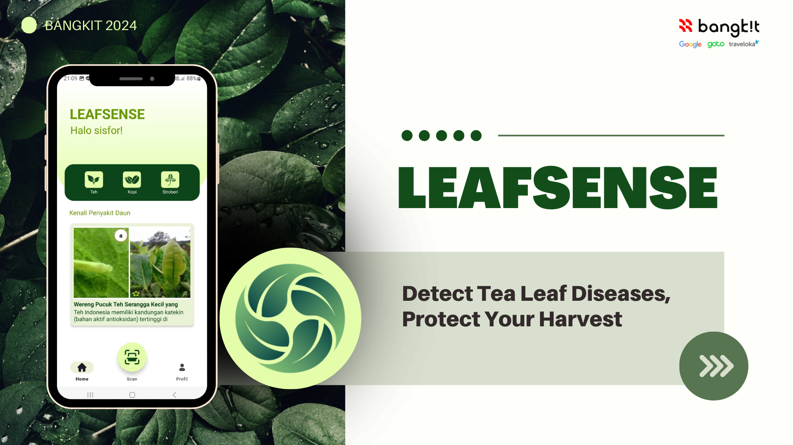
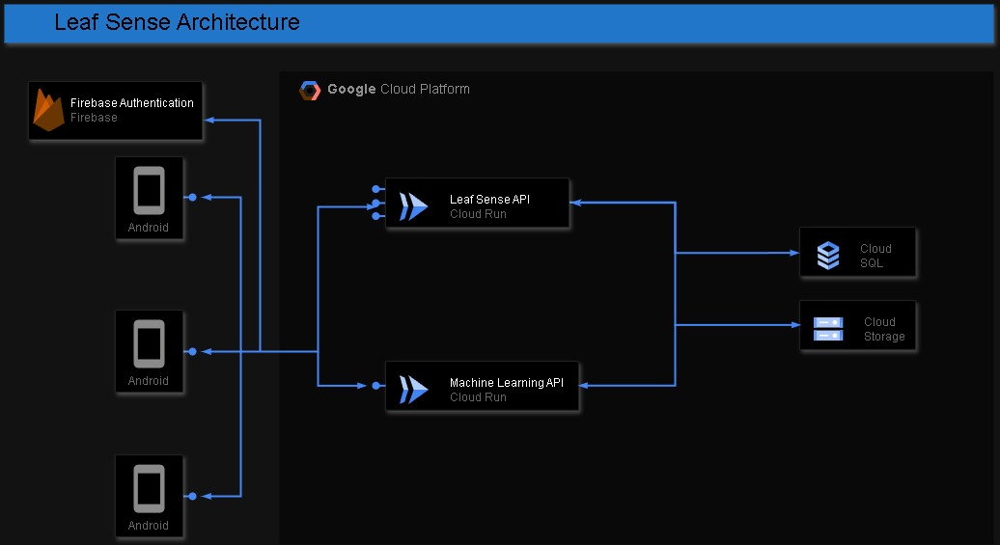

# Leaf Sense - Bangkit Capstone 2024 C242-PS290

## Leaf Sense
**Plant Health Monitor**

---

### About this project
Leaf Sense is designed to assist farmers and agricultural enthusiasts in diagnosing plant diseases quickly and accurately. Utilizing cutting-edge computer vision technology, it identifies diseases affecting tea plants from images. With additional educational features, Leaf Sense empowers users with knowledge on disease management and prevention, promoting healthier crops and sustainable agricultural practices.

### Team Member - C242-PS290
| Bangkit ID         | Name                         | Learning Path      | LinkedIn Profile                                   | GitHub                           |
|--------------------|------------------------------|--------------------|---------------------------------------------------|----------------------------------|
| A128B4KX0914       | Chairania Jasmine Bambang    | Mobile Development | [LinkedIn](https://www.linkedin.com/in/chairania-jasmine-bambang-843a6724b) | [GitHub](https://github.com/Chairania) |
| A128B4KY1418       | Fariz Haidar                 | Mobile Development | [LinkedIn](https://www.linkedin.com/in/fariz-haidar-447b09282) | [GitHub](https://github.com/farizhaidar) |
| M002B4KY1670       | Hafizh Renanto Akhmad        | Machine Learning   | [LinkedIn](https://www.linkedin.com/in/hafizh-renanto-akhmad/) | [GitHub](https://github.com/hafizh-ender) |
| M002B4KX3246       | Naqiya Fadlilatun Nisa       | Machine Learning   | [LinkedIn](https://id.linkedin.com/in/naqiyanisa) | [GitHub](#) |
| C295B4KX3312       | Nazwa Mughni Dwi Cahyani     | Cloud Computing    | [LinkedIn](https://www.linkedin.com/in/nazwamughnidwicahyani) | [GitHub](#) |
| C128B4KY3562       | Raden Gheryl Ivan Mahardika  | Cloud Computing    | [LinkedIn](https://www.linkedin.com/in/gherylmahardika/) | [GitHub](https://github.com/GherylMahardika) |
| M295B4KX4162       | Siti Aenun                   | Machine Learning   | [LinkedIn](https://www.linkedin.com/in/sitiaenun) | [GitHub](https://github.com/aenun111) |

---

### Application Result

---

### Project Architecture
- **Machine Learning API:** Plant disease detection using image processing and classification.
- **Cloud Computing API:** Backend services for CRUD operations, database management, and image storage.
- **Mobile Development:** User-friendly mobile application to upload plant images and view detection results.

---

### Project Documentation
1. **Learning Path Documentation**
   - [Machine Learning](https://github.com/Leaf-Sense/ML-Model)
   - [Cloud Computing (Article API)](https://github.com/Leaf-Sense/Leaf-Sense-Article-API)
   - [Cloud Computing (ML API)](https://github.com/Leaf-Sense/CC-ML-API)
   - [Mobile Development](https://github.com/Leaf-Sense/MD)
